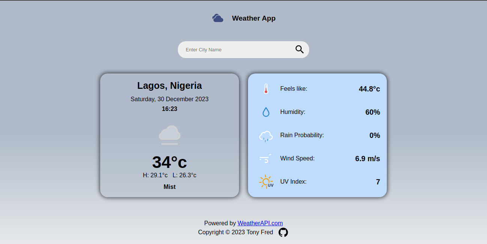

# A Project Template

This was created as a project for [odin project](https://www.theodinproject.com/lessons/node-path-javascript-weather-app) weather app creation project.
This app simply display current weather conditions of city name entered.

.

## Table of Contents

- [Demo](#demo)
- [Build With](#built-with)
- [Contributing](#contributing)
- [License](#license)
- [Development](#development)
- [Acknowledgments](#acknowledgments)

## Demo

You can demo it live at [Demo](https://tonyfred-code.github.io/project-weather-forecast-site/).

## Built With

- JS
- HTML5
- CSS3

## Contributing

Contributions are welcome! If you'd like to contribute to this project, please follow these guidelines:

1. Fork the repository.
2. Create a new branch for your feature or bug fix.
3. Make your changes and commit them.
4. Push your changes to your fork.
5. Create a pull request.

## License

This project is licensed under the [MIT LICENSE](./LICENSE)

## Development

1. Add a current location finder and using that to request weather conditions
2. Add area for displaying hourly weather forecast
3. Add area for displaying weather forecast for next two days

## Acknowledgments

 API is powered by Powered by [WeatherAPI.com](https://www.weatherapi.com/).
 Icons were found on a [similar site](https://eliptik1.github.io/weather-app/)  created by [Ali](https://github.com/eliptik1).
